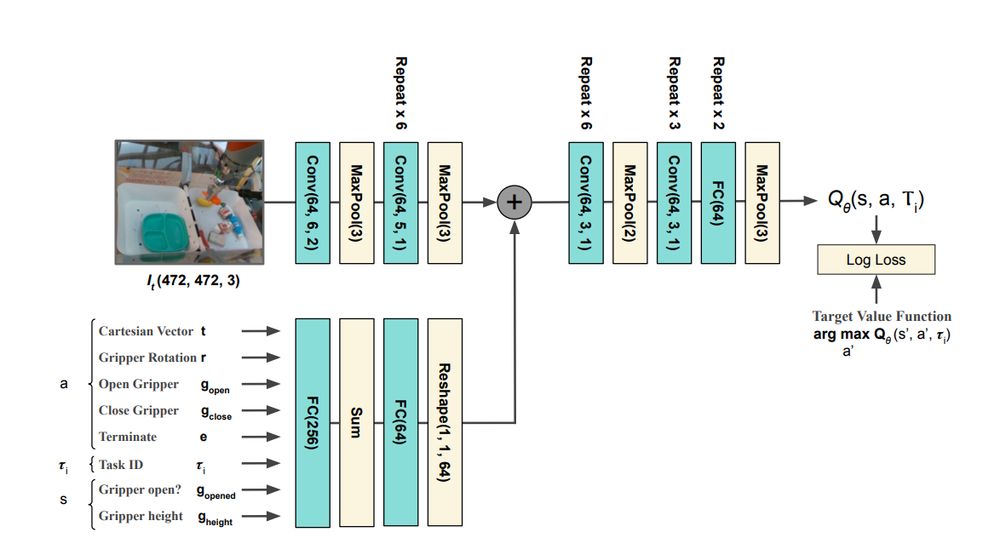
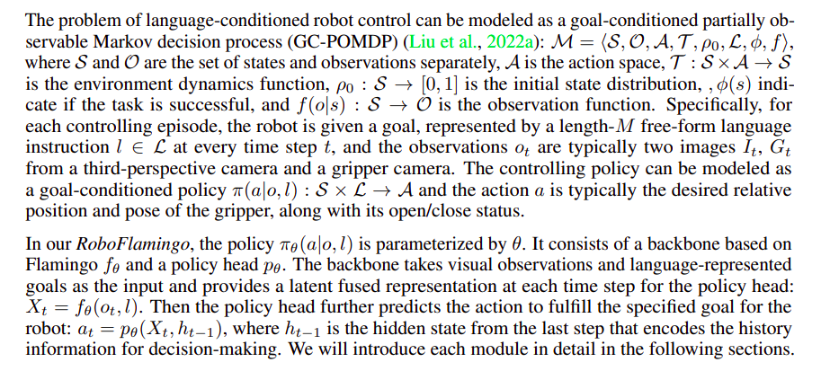

## ROSGPT

- Simple tool for executing actions in turtlebot
- Uses ontology based approach for converting unstrucutred human text to structured JSON objects
- Deserializes the JSON and publishes it to cmd_vel
- Very simple and limited use-case
- No fine-tuning done, only few shot learning

## ManipVQA

- Manip + Visual Question Answering
- ImageNet and PACO don't focus on granular information in images
- Datasets such as HANDAL and PhysObjects are available for robotics, they contain annotation for part marks, object attributes, and affordances
- Affordance defines the possibility of an agent to perform actions with an object.
- ManipVQA merges HANDAL, PhysObjects, PACO etc.
-  Referring Expression Comprehension (REC) involves the model receiving an image accompanied by a natural language description and subse
quently predicting the bounding box coordinates that delin
eate the specified target within the image. 
-  Conversely, REG prompts the model to produce a descriptive natural language statement about an area within an image, defined by pro
vided bounding box coordinates.
- Uses  SPHINX-1K  + LLaMA 2
- Given the necessity for both global and local visual grounding in robotic tasks, we integrate the visual encoder from CLIP [17] to extract local semantic features and the Q-Former [31] for summarizing visual features

## RT-1 

- Robotics Transformers 1
- Lots of details
- Essentially converts NLP to robotic tasks using a transformer architecture
- Uses FiLM EfficientNetB0
- Uses a lot of pre-collected data (130k episodes over 700 tasks, 7 skills and took 17 months to collect)
- Does pre-training with internet data
- Code is open source

## RT - 2
- Robotics Transformers 2
- Tries to use VLMs and LLMs trained on internet data to generalise to robotics tasks and observe emergent behaviours
- trains a Visual Language Action (VLA) model
- Uses LLM + Visual Transformer 
- **Pre-trained on internet corpus**, then fine tuned and co-fine tuned again
- Same dataset as RT-1 used
- Everything is closed source

## CALVIN 
- CALVIN (Composing Actions from Language and Vision)
- It is a dataset of long-horizon tasks, i.e., tasks that require a long sequence of actions to execute properly
- a single agent must solve complex manipulation tasks by understanding a series of unconstrained language expressions in a row, e.g., “open the
drawer . . . pick up the blue block . . . push the block into the drawer . . . open the sliding door”.
- CALVIN includes ∼24 hours teleoperated unstructured play data together with 20K language directives.
- RGB-D images from both a static and a gripper camera, proprioceptive information, and vision-based tactile
sensing.
- Contains camera captures from 2 views, action space being 7DoF of Franka Emika Panda robot
- The benchmark contains a CALVIN environment, Dataset, and Challenge

The CALVIN environment has 4 environments with 34 tasks each

**CALVIN Dataset**
- dataset is free form and the data collectors were given no prior training
- HTC Vive used to collect data
- unstructured by its playful nature

## RoboFlamingo 
- Democratizes RT2 (overcomes closed source nature of the latter along with extensive computational power required)
- Uses CALVIN for training and benchmarking

Different standards present for the research
+ Fine-tune
+ Ask LLM to give policies for execution    
+ Co - tuning - requires a lot of web as well as low level robotics data

Shortcomings - 
+ rely on low-level skill policies
+ train a very alrge model 
+ requires a lot of data

- Uses Flamingo as the backbone VLM. 
- Adds a policy head as a differentiator
- Fine tunes the decoder 

Then there is content about a Markov Decision Process. 

## SayCan 

- Do as I **Can**, not as I **Say**
- Use LLMs to get lower level abstract (step-wise) actions appropriate in the given context and feasible by the robot's action space in the current environment
- uses prompt engineering to get actionable tasks from the LLM, which are then used for controls
- LLM is used to output the most contextually ap
- propriate task (out of a distribution of tasks) and the probability is multiplied with the visual information available with the robot

**IMP**
For learning the value function (giving prob. of success of the tasks possible given visual information), SayCan train individual skills (tasks) either with image-based behavorial cloning (BC-Z), or RL (MT-Opt). MDP is used
- Regardless of how the skill policy is obtained, SayCan utilizes value functions trained via TD backups.
- Multitask policies are trained, so one policy can generalize to different tasks 
- 1 LLM is used to express which task to do, another is used to express those tasks as embeddings for training the policy

**RL Methods**

- Every skill has a policy function, a value function, and a language description
- Human annotators decide the reward function
- Used RetinaGAN to do sim-to-real transfer
- 551 skills that span seven skill families and 17 objects, which include picking, placing and rearranging objects, opening and closing drawers, navigating to various locations, and placing objects in a specific configurations

**Results**
- Planning success rate of 84% and execution success rate of 74%    

**Shortcomings** 
- Biases of LLM
- fixed set of skills
- open loop control

**Future Work**
+ real world experience can be used to improve the LLM itself
+ other sources of grounding
+ other ontology rather than natural language

# Comparison Table 

| **Feature/Tool**       | **ROSGPT**                                               | **ManipVQA**                                                                 | **RT-1**                                                    | **RT-2**                                                      | **CALVIN**                                                                                      | **RoboFlamingo**                                          | **SayCan**                                                    | **MT-Ops**                  | **Reinforcement Learning**                |
|------------------------|----------------------------------------------------------|-----------------------------------------------------------------------------|------------------------------------------------------------|-------------------------------------------------------------|-------------------------------------------------------------------------------------------------|------------------------------------------------------------|-------------------------------------------------------------|-----------------------------|-------------------------------------------|
| **Purpose**            | Execute actions in TurtleBot                             | Visual Question Answering with granular image information                    | NLP to robotic tasks using transformers                     | Generalize robotic tasks with VLMs and LLMs                 | Long-horizon tasks with language and vision                | Democratize RT-2                                             | Contextual task execution using LLMs                        | Multitask operations         | Teach robot multiple tasks              |
| **Key Approach**       | Ontology-based, few-shot learning                        | Combines multiple datasets (HANDAL, PhysObjects, PACO)                        | Transformer architecture, pre-trained on large datasets     | VLA model, pre-trained on internet corpus                   | Free-form, unstructured play data                          | Uses Flamingo VLM, adds policy head, fine-tunes decoder     | Uses LLM for task abstraction, combines with visual info     | RL training for multiple tasks | Value and policy function training     |
| **Datasets**           | -                                                        | HANDAL, PhysObjects, PACO                                                    | 130k episodes, 700 tasks, 7 skills                          | Same as RT-1                                                | ∼24 hours teleoperated play data, 20K language directives  | CALVIN                                                      | Image-based behavioral cloning (BC-Z), RL (MT-Opt)           | -                            | Q function and policy function training |
| **Learning Method**    | Few-shot learning                                        | SPHINX-1K, LLaMA 2, CLIP, Q-Former                                           | Pre-training with internet data, open source                | Pre-trained and co-fine-tuned, closed source                | HTC Vive for data collection                                | Fine-tune, ask LLM for policies, co-tuning                 | Prompt engineering, TD backups                                | -                            | Q function, maximize for policy         |
| **Challenges**         | Simple, limited use-case                                 | Focuses on affordances, detailed annotations                                 | Requires extensive data collection                          | Closed source                                               | Unstructured nature of dataset                              | Overcomes RT-2's closed source, computational power         | Biases of LLM, fixed set of skills, open loop control        | On-robot training, engineering each task | -                                         |
| **Advantages**         | Easy to implement                                        | Granular image information, merges multiple datasets                         | Open source, large pre-collected dataset                    | Emergent behaviors, uses VLMs and LLMs                      | Long-horizon task execution, combines language and vision   | Democratizes RT-2, accessible, computationally efficient    | Combines visual info with LLM context                        | Multitask vision-based object grasping | Discrete and continuous action spaces |
| **Future Work**        | -                                                        | -                                                                           | -                                                           | Real-world experience to improve LLM, other grounding sources | Improve LLM with real-world experience                      | Expand to other grounding, ontology other than natural language | Other sources of grounding, expand skill set | -                            | -                                         |
| **Results**            | -                                                        | -                                                                           | -                                                           | -                                                           | -                                                                                               | -                                                          | 84% planning success, 74% execution success                  | -                            | -                                         |

# Appendix

## MT-Ops (MultiTask Operations)

- Teach a robot how to do multiple tasks
- **Problems with current RL tasks** - lot of on-robot training, and engineering each task
- Example - QT-Ops can  do vision-based object grasping, but requires over 500,00 trials collected across multiple robots
### Will study the given architecture in more detail if our project requires multitask RL training

## Reinforcement Learning

### Value Function Training- 
Gives the value of the total reward starting from time t, given the current state and action. We can train the Q Function and maximize it for a given state to get the policy function. However, it does not utilize temperature (for exploration) and is suited for discrete action space only.
### Policy Function Training - 
Optimize the policy function directly - can model continuous action spaces. 

