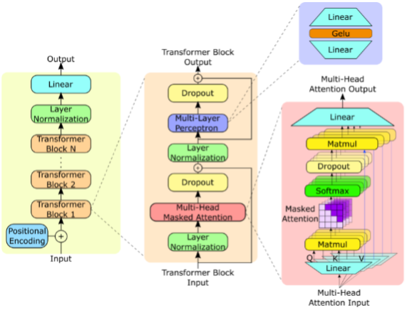

# BERT

**Bidirectional Encoder Representation from Transformers.**

BERT is an encoder used to create contextual embeddings compared to other word embedding models like Word2Vec and GloVe, which create non-contextual embeddings.

BERT used WordPieces as the tokenizer, which is similar to BPE(Byte Pair Encoding). Still, instead of merging the most frequent pair of tokens, it looks at the likelihood of the entire vocabulary and chooses the token pair that increases the likelihood.

Pre-training:

Instead of the traditional language modelling (next token prediction) we use in common LLMs, we do 2 tasks:

1. Masked Language Modelling
1. Next Sentence Prediction

Masked Language Prediction:

BERT is bidirectional, which means it looks at the context before and after the current word. Due to the self-attention mechanism, every token looks at all other tokens, including itself. This allows the token to indirectly “see itself”. Thus, approaching the sentence from the opposite direction, we already know what word was present. So, we randomly select 15% of the tokens in the sentence and replace them with [MASK] tokens. The task of the model becomes predicting the word in the positions of the [MASK] tokens.

One problem this produces is inconsistency during pretraining and fine-tuning. Since [MASK] tokens will not be present during fine-tuning, the model may overfit since the pre-trained model only predicts when the [MASK] token is present. So, 80% of the tokens are replaced with [MASK] tokens, 10% are replaced with random tokens, and 10% remain unchanged.

Next Sentence Prediction:

Its task is to predict a binary value that indicates the relationship between 2 sentences, which says whether sentence A occurs immediately after sentence B. During the pretraining, 50% of the time, we input 2 consecutive sentences and 50% of the time, we don’t. For this task, we utilize 2 more tokens:

1. [CLS] token: Classifier token is added to the start of the 1st sentence. Since in self-attention, every token looks at every other token, the [CLS] token captures the relationship with every other token and thus can be said to hold the context of the entire sentence. For getting the final output, we look at the final hidden state corresponding to the [CLS] token.
1. [SEP] token: Separation token is placed at the end of the 1st and 2nd sentences. As its name suggests, it indicates the end of each sentence and separates the 2 sentences. Used to separate segments in the input like question, answer and related passage.

These tokens are placed before the training starts, i.e, during the preprocessing step. Once the tokens are placed, we create their token embeddings and also add the positional embedding. Along with that we also add segment embedding that helps the model know which of the 2 sentences a word is a part of.

A key difference of BERT from vanilla transformer is that it learns the positional embeddings in contrast to transformers having fixed values for them that are computed only once.

They learn the token embeddings and segment embeddings as well.

# LLAMA

Pre-training Data:

- CommonCrawl
- Github
- ` `Wikipedia
- Books
- ArXiv
- StackExchange

Tokenizer:

- We tokenize the data with the byte pair encoding (BPE) algorithm (it’s an efficient data compression technique)

Architechture:

- The network is based on the transformer architecture. We leverage various improvements that were subsequently proposed and used in different models, such as PaLM.
- Pre-normalization [GPT3]. To improve the training stability, we normalize the input of each transformer sub-layer, instead of normalizing the output. We use the RMSNorm normalizing function
- SwiGLU activation function . We replace the ReLU non-linearity by the SwiGLU activation function, to improve the performance. We use a dimension of 2 /3 4d instead of 4d as in PaLM.
- Rotary Embeddings [GPTNeo]. We remove the absolute positional embeddings, and instead, add rotary positional embeddings (RoPE)

Optimizer:

- Our models are trained using the AdamW optimizer with the following hyper-parameters: β1 = 0.9, β2 = 0.95. We use a cosine learning rate schedule, such that the final learning rate is equal to 10% of the maximal learning rate. We use a weight decay of 0.1 and gradient clipping of 1.0.
- Reduce the memory usage of the model by using model and sequence parallelism

Fine-tuning:

Carbon footprint:

- we do not take the location of data center in consideration, and use, instead, the US national average carbon intensity factor of 0.385 kg CO2eq/KWh. This leads to the following formula for the tons of carbon emissions: tCO2eq = MWh × 0.385.

Scaling:

- While this work relied on a simple smoothing technique, called Stupid Backoff
- This allowed to train a 5-gram model on 975 billions tokens from CommonCrawl, resulting in a model with 500 billions n-grams

# GEMINI

Architecture:

- Gemini models build on top of Transformer decoders that are enhanced with improvements in architecture and model optimization to enable stable training at scale and optimized inference on Google’s Tensor Processing Units.

- Its multimodal-The visual encoding of Gemini models is inspired by our own foundational work on Flamingo.

  

Pre training dataset:

- Gemini models are trained on a dataset that is both multimodal and multilingual. Our pre-training dataset uses data from web documents, books, and code, and includes image, audio, and video data.

- We apply quality filters to all datasets, using both heuristic rules and model-based classifiers. We also perform safety filtering to remove harmful content based on our policies.

Comparison:

Performance:

Multimodal:

- Gemini models are natively multimodal. These models exhibit the unique ability to seamlessly combine their capabilities across modalities (e.g. extracting information and spatial layout out of a table, a chart, or a figure) with the strong reasoning capabilities of a language model

POST TRAINING MODEL

- After large-scale pre-training, we apply post-training, where one trains on top of a pre-trained model in order to extend the model’s proficiency and to enable a wide variety of capabilities

METHODS FOR POST TRAING

- PROMPT DATA COLLECTION
- SFT ON DEMONSTRATION DATA
- RM TRAINING ON FEEDBACK DATA
- RLHF

  

# GPT

- GPT stands for Generative Pre-Trained Transformer. It is used for **generating** text using a **pre-trained** model based on a **transformer** architecture.

  

### GPT-2

- It has 1.5 billion parameters (large) and was trained on a dataset of 8 million web pages.

  

- Model size is > 5GB.
- Has a decoder-only transformer, used for generating text.
- Can be fine tuned locally (free).
- Does not incorporate RLHF – has inherent societal and national biases.
- Uses Byte-Pair Encoding with word ending tokens </w>
- Uses zero shot learning for multitask operations (instead of domain specific finetuning)
- Trained on custom dataset WebText (containing outbound links from Reddit, having at least 3 karma). Final dataset has 8 million documents with 40GB of text. Wikipedia was removed from this corpus to reduce overlap with other State-of-the art models.
- Model uses layer normalization, and initialization using inverse square root. Vocabulary size is 50,257 and the context size is 1024. Batch size of 512 is used.
- Suited for the following tasks –

- Language Modelling
- Summarization
- Reading Comprehension
- Long-range dependencies in input
- Common sense reasoning

Does not perform well on –

1. Question Answering
1. Language Translation
1. Zero-shot performance is not usable in the real world. Requires fine tuning to fit suitable tasks.

The only major difference between GPT-2 and GPT-3 is the number of parameters of the model and the size of dataset it was trained on.

### GPT-3.5

The key characteristic of this was the inclusion of Reinforcement Learning through human feedback.

The way ChatGPT is trained:

# Claude 3

- Proprietary (no architecture available)
- Self-supervised learning process
- Multimodal
- Uses RLAIF (Reinforcement Learning from Artificial Intelligence Feedback)
- API is paid –

  

  Haiku is the fastest and Opus can do the most complex reasoning.

- Trained using constitutional AI - outlines principles such as freedom, opposition to inhumane treatment, and privacy.
- Can’t finetune or do local inference
- Better at coding tasks and sensitive-decision making
