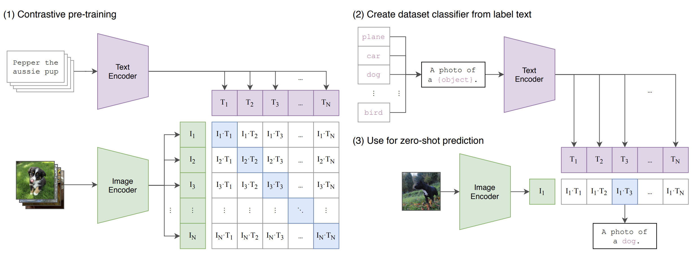
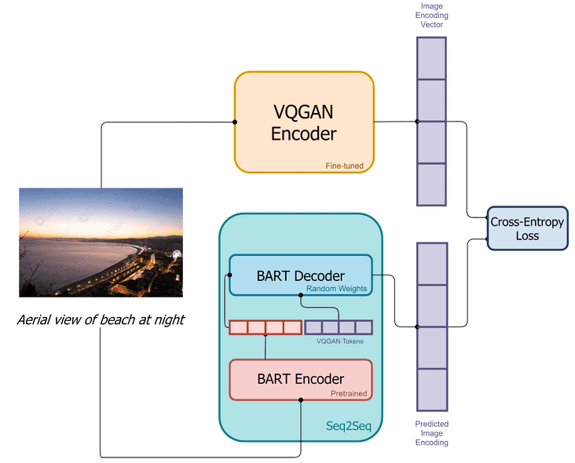
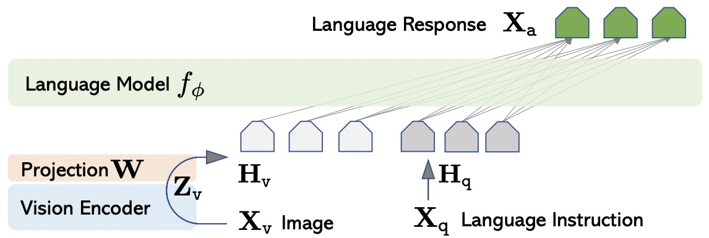
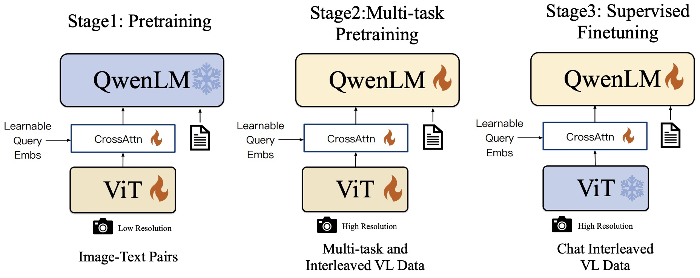

# CLIP

**Contrastive Language Image Pretraining**

- Contrastive learning is the method to train a model to distinguish between similar and dissimilar things.
- Trained on 400 million (image, text) pair.

### Pretraining process:

- First we pass the image and text pair to their respective image encoder and text encoder in order and get the output matrix.
- The 2 matrices are multiplied by some matrix to make their size the same and do L2 normalisation on them.
- Then cosine similarity is calculated between each pair of image and text creating a matrix.

The goal of the model is to maximise the similarity of the diagonal elements and minimise the rest. To do that symmetric cross entropy loss is calculated both rowwise and columwise considering the ith element in ith row/column has the lowest value(in cosine similarity, higher the similarity lower the value). Final loss value is the average of the rowwise and columnwise loss.

# DALL-E

Typically used for visual generation from text description. Uses a discrete variatiional autoencoder(uses a dicrete latent space) for mapping image to image tokens. Uses Byte Pair Encoding for tokenisation of text.
Image and text tokens are processed together as a single data stream.

Training pipeline of DALL-E mini:

It uses BART which is an autoregressive transformer to process the stream in order to model the joint distribution of text and images.
At inference time, we concatenate the tokenized target caption with a sample from dVAE and pass the data stream to the autoregressive decoder, which will output a novel image token.

# LLaVa

It is the first attempt to use language-only GPT-4 to generate multimodal language-image instruction-following data. By instruction tuning on such generated data, they introduce Large Language-and-Vision Assistant (LLaVA), an end-to-end trained large multimodal model that connects a vision encoder and LLM for general-purpose visual and language understanding.

LLaVA is a minimal extension of the LLaMA series which conditions the model on visual inputs besides just text. The model leverages a pre-trained CLIP’s vision encoder to provide image features to the LLM, with a lightweight projection module in between.

The model is first pre-trained on image-text pairs to align the features of the LLM and the CLIP encoder, keeping both frozen, and only training the projection layer. Next, the entire model is fine-tuned end-to-end, only keeping CLIP frozen, on visual instruction data to turn it into a multimodal chatbot.

# Qwen-VL

SOTA results.

Components:

- Large Language Model:
  Qwen-VL adopts a large language model as its foundation component. The model
  is initialized with pre-trained weights from Qwen-7B.
- Visual Encoder:
  The visual encoder of Qwen-VL uses the Vision Transformer (ViT)
  architecture, initialized with pre-trained weights from Openclip’s ViT-bigG. During
  both training and inference, input images are resized to a specific resolution. The visual encoder processes
  images by splitting them into patches with a stride of 14, generating a set of image features.
- Position-aware Vision-Language Adapter: To alleviate the efficiency issues arising from long image feature
  sequences, Qwen-VL introduces a vision-language adapter that compresses the image features. This adapter
  comprises a single-layer cross-attention module initialized randomly. The module uses a group of trainable
  vectors (Embeddings) as query vectors and the image features from the visual encoder as keys for crossattention operations. This mechanism compresses the visual feature sequence to a fixed length of 256. Additionally, considering the significance
  3
  of positional information for fine-grained image comprehension, 2D absolute positional encodings are
  incorporated into the cross-attention mechanism’s query-key pairs to mitigate the potential loss of positional
  details during compression. The compressed image feature sequence of length 256 is subsequently fed into
  the large language model.

# SigLip

Proposed to replace the loss function in CLIP by a simple pairwise sigmoid loss. Softmax normalization in standard contrastive learning, including in CLIP, involves calculating the exponential of a score for each image-text pair and dividing it by the sum of exponentials for all pairs in a batch. his process creates a probability distribution over the batch, helping the model to differentiate between correct and incorrect pairs. This approach, while effective, is computationally intensive and sensitive to batch size.

SigLIP’s Sigmoid loss evaluates image-text pairs independently, allowing for larger batch sizes and better performance in smaller batches. This independence from global pairwise normalization enhances scaling and efficiency.

Good at zero shot image classification.

# ImageBind

Its multimodal, aligns 6 modalities embedding into a common space : images , text, audio, depth, thermal and IMU(inertial measurement unit)

## Documentation

it uses image-text paired data.

it uses cross modal retrieval embedding space arithmetic

## TRAINING

### Data set

web image data

depth data

sensor data

web videos

thermal data

egocentric videos

### Architecture

For text encoder(302M params) it uses OpenCLIP(frozen)

For image encoder it uses ViT-H 630 params,
it treates videos as 2 frame images.

uses seperate modality specific encoders and linear projection heads .

uses 0 shot classification

## Applications

Multimodal embedding space arithmetic - no need to re train data in this ,we can just upgrade it

Take pre trained text based detection model-Detic - it creates an audio based detector that acn detect and segment objects based on audio prompts

# ALIGN

A Large-scale ImaGe and Noisy text embedding(ALIGN)

## Documentation

learns pre trained representations for vision and vision language

large scale data sets , have supervised training
require lot of human effort

## Architecture

large scale data: 1 B img- text pairs
Noise removal: simple data cleaning
Shared Embedding : uses dual encoderarchitecture (ConVIRT)

uses cosine similarity contrastive training loss

paired texts acts as fine-grained labels for images
Image encoder - EfficientNet-2 with global pooling

final resolution to 289 \* 289
random crop + horizontal flip training

Text Encoder : BERT- Large wuith (CLS) Token embedding +FC layer(max 64)
follow zero shot learnig

Loss function:

## Data set

web images -1.8 B pairs

image -based filtering

text based filtering

# GEMMA

### Architecture

based on the transformer decoder model

Parameters for comparisons

uses multiQuery Attention , RoPE Embedding (rotatory positional embedding)

activation : GeGLU Activation

Normalization : RMS Norm

### Training:

gemma models are trained using TPUv5e; they are deployed in pods of 256 chips, configured into a 2D torus of 16 x 16 chips

### Training Data

Gemma 2B and 7B are trained on 3T and 6T
tokens respectively of primarily-English data from
web documents, mathematics, and code

## Instruction Tuning

Supervised Fine-Tuning

Filtering

Reinforcement Learning from Human Feedback

### Memorization Evaluation

No sensitive data was memorized.

Gemma models improve performance on a
broad range of domains including dialogue, reasoning, mathematics, and code generation. Results on MMLU (64.3%) and MBPP (44.4%)
demonstrate both the high performance of
Gemma, as well as the continued headroom in
openly available LLM performance.
